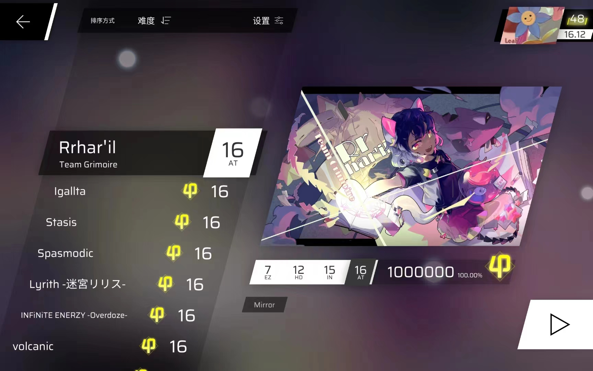

# 基于[Phisap](https://github.com/kvarenzn/phisap)项目修改的Phigros Autoplay Script


+ 使用ttkbootstrap优化了UI , 删去了无用的界面
+ 开箱即用,修复了原项目scrcpy存在的BUG
+ 镜像模式的支持
+ 全版本/自制铺面的支持

## 成果展示

<details>
<summary>如图</summary>



</details>


## 如何使用


```bash
git clone https://github.com/ClankySun10936/Phigros-Autoplay-Script
pip install -i requirements.txt
python main.py
```


## 要求

Python 3.10及以上版本

正确安装并配置ADB环境变量 

##  Tips
+ 推荐使用手动同步(即在第一个音符快接近判定线时按下空格),Phigros铺面文件中并未给出每首曲子的前摇时长
+ 每个铺面规划完一次后会写入缓存，下次使用同一铺面时无需重复规划（镜像模式暂不支持）
+ 搭配ADB TCP mode 可实现无线Autoplay(可能出现一些延迟和误差)

## 结语


如果本项目帮到了你，并且你想为本项目做些什么，那么你可以：

+ 使用你的双手练习你使用本项目完成过的曲目，争取拿到金色的phi

+ 给这个项目点个star

  
